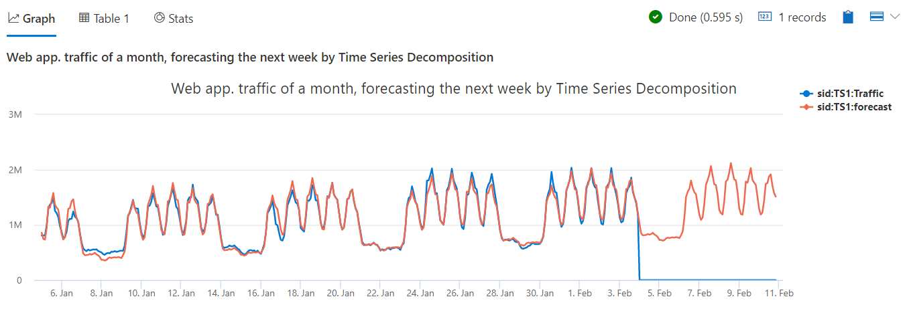

# Module 5 - Time Series Analysis 2 - Anomaly Detection and Forecasting

## Demo 3 - Forecasting

### Overview

Another function in the seasonal decomposition family is `series_decompose_forecast`. Using it we can predict values into the future.

### Examining the Code

The code for this demo is very similar to what we've seen so far.

```python
let min_t = datetime(2017-01-05);
let max_t = datetime(2017-02-03 22:00);
let dt = 2h;
let horizon=7d;
demo_make_series2
  | make-series Traffic=avg(num)
             on TimeStamp
           from min_t to max_t+horizon step dt
             by sid
    // select a single time series for a cleaner visualization
  | where sid == 'TS1'
  | extend forecast = series_decompose_forecast(Traffic, toint(horizon/dt))
  | render timechart
      with (title='Web app. traffic of a month, forecasting the next week by Time Series Decomposition')
```

As before, we're using `demo_make_series2` as our source. The first addition you see is the declaration of the `horizon` variable. This indicates the duration for the forecast, here we set it to 7 days.

The second thing is in the `make-series` statement, where we set the upper boundaty `to max_t+horizon`. We already extend the input time series to include future timepoints for our forecast. We don't have values for these points so by default they are filled with 0.

Then we call `series_decompose_forecast`. The first parameter is `Traffic`, the time series we want to forecast on. 

The second is the number of points at the end of the time series that we want to exclude from the 'training', i.e. from building the seasonal decomposition model. As we extended the time series with zeros for the forecasting horizon of 7 days, we divide it by the 2 hours bin size. This yields the last 84 points to exclude from training. Note that we left these points off the training, but once the function builds the baseline component, it will extrpolate it to also forecast the 7 days horizon. 

As the 2 other seasonal decomposition functions, this function can accept also the seasonality and trend parameters, but we didn't specify them explicitly, here we just left the defaults, -1 for auto detect seasonality and 'linefit' for trend analysis.

Finally we render the result as a timechart. Let's take a look.

### Analyzing the Output



In this chart, we see two lines. For the past, you can compare the forecast (which is just the baseline that we have seen before) vs the actual Traffic. For the future of seven days, the forecast line predicts the Traffic values while we don't have real values for the actual traffic .

### Summary

Using `series_decompose_forecast` you can predict future values of your time series. This function is also based on the seasonal decomposition model, where the baseline component is the prediction.
